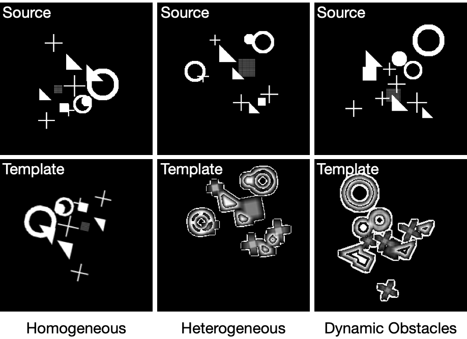
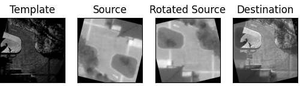
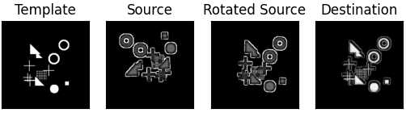

# DPCN: Deep Phase Correlation for End-to-End Heterogeneous Sensor Measurements Matching

This is the official repository for DPCN, with paper "[Deep Phase Correlation for End-to-End Heterogeneous Sensor Measurements Matching](https://arxiv.org/abs/2008.09474)" accpepted in CoRL2020.

## Dependencies

There are a few dependencies required to run the code.  They are listed below:

### System Environments:

`Python >= 3.5`

`CUDA 10.1`

`CuDnn`

### Pip dependencies:

`Pytorch 1.5.0`

`Torchvision 0.6.0`

`Kornia`

`Graphviz`

`Opencv`

`Scipy`

`Matplotlib`

`Pandas`

`TensorboardX`

You can install these dependencies by changing your current  directory to this DPCN directory and running:

`pip install -r requirements.txt  -f https://download.pytorch.org/whl/torch_stable.html` (if using pip),

or manually install these dependencies if it makes you feel more comfortable and assured.

We would suggest you to setup the whole environment in Conda or Virtualenv so that your original system will not be affected.

### Pre-trained Models:

***Pre-trained Models can be downloaded from this link:</u>***   https://drive.google.com/file/d/1GZ8hz3cfaBP7F7KEdQK7M_WcwOM1GF6z/view?usp=sharing

## How to Run The Code

### Step 0

Before you start to train or validate on the simulation dataset, you might want to choose one specific dataset type of the following three: Homogeneous, Heterogeneous, and Dynamic Obstacles. Demonstrations are shown as follows:

**By default, the code is running on Heterogeneous dataset** and you can change this by modifying following lines in "./data/simulation.py".

1. To decide whether they are heterogeneous, modify line 78~80:

   `# for heterogeneous image, comment out if you want them to be homogeneous
       rot = cv2.GaussianBlur(rot, (9,9), 13)
       kernel = np.array([[-1,-1,-1],[-1,9,-1],[-1,-1,-1]])
       rot = cv2.filter2D(rot, -1, kernel)`

2. To decide whether there are dynamic obstacles, modify line 83~85

   `# for dynamic obstacles, comment out if you dont want any dynamic obstacles
        arr[0,] = add_plus(arr[0], *plus_location4)
        arr = np.reshape(arr, (1, height, width)).astype(np.float32)`

   

### Training

If you want to train the DPCN network from scratch on simulation dataset then simply run:

`python trainDPCN.py --simulation`.

By default, this will train the network on the heterogeneous dataset with the batch size of 2, and will run on GPU. There are several settings you can change by adding arguments below:

| Arguments           | What it will trigger                                         | Default                     |
| ------------------- | ------------------------------------------------------------ | --------------------------- |
| --save_path         | The path to save the checkpoint of every epoch               | ./checkpoints/              |
| --simulation        | The training will be applied on a randomly generated simulation dataset | False                       |
| --cpu               | The Program will use cpu for the training                    | False                       |
| --load_pretrained   | Choose whether to use a pretrained model to fine tune        | Fasle                       |
| --load_path         | The path to load a pretrained checkpoint                     | ./checkpoints/checkpoint.pt |
| --load_optimizer    | When using a pretrained model, options of loading it's optimizer | False                       |
| --pretrained_mode   | Three options:  'all' for loading rotation and translation;  'rot' for loading only rotation;  'trans' for loading only translation | All                         |
| --use_dsnt          | When enabled, the loss will be calculated via DSNT and MSELoss, or it will use a CELoss | False                       |
| --batch_size_train  | The batch size of training                                   | 2                           |
| --batch_size_val    | The batch size of training                                   | 2                           |
| --train_writer_path | Where to write the Log of training                           | ./checkpoints/log/train/    |
| --val_writer_path   | Where to write the Log of validation                         | ./checkpoints/log/val/      |

### Validating

If you are only interested in validating on the randomly generated simulation dataset, then you can simply run following lines based on the specific dataset type you chose in **Step 0**.

For **Homogeneous** sets:

`python validate.py --simulation --only_valid --load_path=./checkpoints/checkpoint_simulation_homo.pt`

For **Heterogeneous** sets:

`python validate.py --simulation --only_valid --load_path=./checkpoints/checkpoint_simulation_hetero.pt`

For **Dynamic** Obstacle sets:

`python validate.py --simulation --only_valid --load_path=./checkpoints/checkpoint_simulation_dynamic.pt`

***<u>Again, Pre-trained Models can be downloaded from this link:</u>***   https://drive.google.com/file/d/1GZ8hz3cfaBP7F7KEdQK7M_WcwOM1GF6z/view?usp=sharing

Similarly, there are several options that you can choose when running validation, shown as follows:

| Arguments         | What it will trigger                                         | Default                     |
| ----------------- | ------------------------------------------------------------ | --------------------------- |
| --only_valid      | You have to use this command if you run validation alone     | False                       |
| --simulation      | The training will be applied on a randomly generated simulation dataset | False                       |
| --cpu             | The Program will use cpu for the training                    | False                       |
| --load_path       | The path to load a pretrained checkpoint                     | ./checkpoints/checkpoint.pt |
| --use_dsnt        | When enabled, the loss will be calculated via DSNT and MSELoss, or it will use a CELoss | False                       |
| --batch_size_val  | The batch size of training                                   | 2                           |
| --val_writer_path | Where to write the Log of validation                         | ./checkpoints/log/val/      |

### Detecting and Infering:

This repository also provided a single pair detecting script so that you can see the result of  DPCN directly.  A few demos are given in the "./demo" directory including images pairs from both simulation dataset and Aero-Ground Dataset. You could customize the script `detect.py` to test the chosen images pair with relative pre-trained model given, and run this code below:

`python detect.py`

The results should be something like this:

## HAVE FUN with the CODE!!!!
